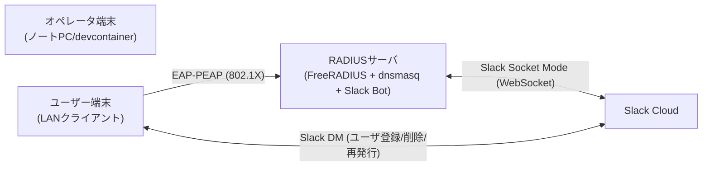
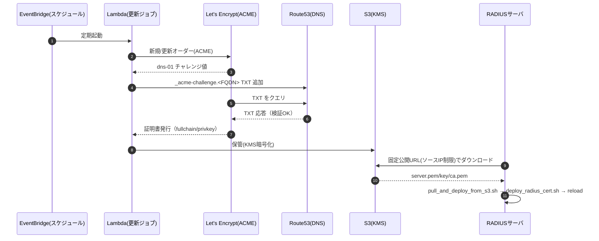

# RADIUS + Slack連携 有線LAN認証システム（本番運用ガイド）

本ドキュメントは、公開CA（Let's Encrypt）＋DNS-01（Route53）で取得したサーバ証明書を用い、FreeRADIUS（PEAP）＋Slack Bot（Socket Mode）＋dnsmasq（DHCP）＋Cisco Catalyst（802.1X）を本番運用するための手順に特化しています。開発向け手順は付録に分離します。

---

## 目的と前提
- 目的: 認証成功端末のみVLAN10へ収容し、ユーザーはSlackから自身のRADIUSアカウントをセルフ運用。
- 規模: 約30台（Mac中心、一部Windows/Linux）。
- 認証方式: IEEE 802.1X（EAP-PEAP + MSCHAPv2）。クライアント証明書は不要。
- ネットワーク: Cisco Catalyst。未認証は遮断（ゲストVLANなし）。
- サーバ: オンプレMiniPC上でDocker稼働。
- 証明書: 公開CA（Let's Encrypt）をDNS-01（Route53）で取得。サーバ名検証を必須化。

---

## 構成概要
- FreeRADIUS: PEAP認証。Slack BotがユーザーID/パスワードを管理。
- Slack Bot（Python, slack_bolt, Socket Mode）: DMコマンドでユーザー自身が登録/削除/再発行。
- dnsmasq: DHCP（DNS機能は無効化）。VLAN10へIP配布。
- Cisco Catalyst: 802.1X中継。成功時のみVLAN10へ。

---

## 事前準備
- FQDN: `radius.example.com`（サーバ名検証に使用）
- CAAを運用している場合はLet's Encryptを許可
  - 例: `CAA 0 issue "letsencrypt.org"`
- Route53: Lambda に最小権限のTXT更新権限を付与（RADIUSサーバにAWS資格情報は不要）
- ネットワーク設計
  - VLAN10: 192.168.40.0/22（GW 192.168.40.1）
  - 802.1X成功時のみVLAN10へ。未認証は遮断。
- RADIUSサーバからインターネット（HTTPS）へアウトバウンド可能（S3から証明書取得のため）
- S3側でバケット/オブジェクトへのアクセス制御（固定公開URL + ソースIP制限）

---

## 簡易構成図




## 環境変数（.env）
- Radiusサーバサイド（botコンテナ）
  - `SLACK_APP_TOKEN=...`  Socket Mode用App-Level Token（xapp-）
  - `SLACK_BOT_TOKEN=...`  Bot User OAuth Token（xoxb-）
  - `RADIUS_FQDN=...`  公開CAのFQDN（PEAPのサーバ名検証用）

- Radiusサーバサイド（Pull配布用）
  - `CERT_URL_SERVER_PEM=...` S3上のserver.pem(URL)
  - `CERT_URL_SERVER_KEY=...` S3上のserver.key(URL)
  - `CERT_URL_CA_PEM=...`    S3上のca.pem(URL)
  - `RADIUS_FQDN=...`  公開CAのFQDN（PEAPのサーバ名検証用）


---

## セットアップ手順（本番）

### 証明書発行・保存（Lambda 側の要点）
- certbot/lego + Route53 直更新（dns-01）。`_acme-challenge.<FQDN>` のTXTをLambdaが追加・検証・削除
- 発行した `fullchain.pem`/`privkey.pem`/`ca` を S3(KMS) に保存
- 固定の公開URL（`https://<bucket>.s3.<region>.amazonaws.com/<path>`）を使用し、S3バケットポリシーでRADIUSサーバの送信元IPに限定

### RADIUSサーバ側（サービス起動）
1) リポジトリ取得
```bash
git clone https://github.com/<org>/RADIUS-Bot.git
cd RADIUS-Bot
```

2) RADIUS初期ファイル
```bash
cp radius/authorize.sample radius/authorize   # 初回のみ
openssl dhparam -out radius/certs/dh 2048 && chmod 644 radius/certs/dh
```
3) VLANサブIFとdnsmasq設定
```bash
# 例: 物理IFが eno1、VLAN10 を使用
sudo ip link add link eno1 name eno1.10 type vlan id 10
sudo ip link set eno1.10 up
# dnsmasq/dnsmasq.conf の interface= を eno1.10 に変更
```
4) 起動
```bash
docker-compose up -d --build
```
5) ログ確認
```bash
docker-compose logs -f freeradius | sed -n '1,120p'
docker-compose logs -f dnsmasq | sed -n '1,120p'
```
6) Cisco Catalyst（例）
```cisco
! グローバル
aaa new-model
dot1x system-auth-control
radius server RADIUS1
 address ipv4 <RADIUSサーバIP> auth-port 1812 acct-port 1813
 key radiusSecret
!
! 対象ポート（例: Gi1/0/1）
interface Gi1/0/1
 switchport mode access
 authentication port-control auto
 dot1x pae authenticator
 authentication event success vlan 10
! 未認証は遮断（ゲストVLANなし）
```

### Slack App（Socket Mode）
- コマンド: `/radius_register`, `/radius_unregister`, `/radius_status`, `/radius_resetpass`, `/radius_help`
- 構成
  - Socket Mode有効化、App-Level Token（SLACK_APP_TOKEN）
  - Bot Tokenスコープ: `chat:write`, `commands`, `im:history`, `users:read`

---

## 運用
- 証明書の更新（90日ごと）
  - EventBridge で Lambda を定期実行（残存日数<=30日で更新）
  - RADIUS サーバは S3 から `pull_and_deploy_from_s3.sh` で取得・反映
- 監視/ログ
  - `docker-compose logs -f freeradius`
  - `docker-compose logs -f dnsmasq`
  - Catalyst: `show authentication sessions`, `show dot1x all`
- セキュリティ
  - クライアントで「サーバ証明書検証＋サーバ名一致」を必須化
  - 秘密鍵（server.key）は600/リポジトリ非管理
  - Slackトークンは.envで厳格管理

---

## 証明書更新フロー（Route53 直更新 + Lambda｜Pull配布）

- 前提
  - EventBridge が Lambda を定期起動（毎日/毎週）
  - Lambda はRoute53のホストゾーンにTXTを追加できる最小権限を保持
  - 発行後の `fullchain.pem`/`privkey.pem` は S3(KMS) に格納

- データフロー（何が・いつ・どこへ）
  - チャレンジ値: Lambda → Route53（`_acme-challenge.<FQDN>` TXTを追加）
  - チャレンジ検証: Let’s Encrypt → Route53（TXT確認）
  - 証明書発行: Let’s Encrypt → Lambda（`fullchain.pem`/`privkey.pem`）
  - 保管: Lambda → S3(KMS)
  - 配布: RADIUSサーバが S3 から取得（`pull_and_deploy_from_s3.sh`）→ `deploy_radius_cert.sh` → FreeRADIUS再読込




補足
- RADIUS サーバには AWS 資格情報を置かない（S3固定公開URL + ソースIP制限によるPull運用）


---


## S3 Pull 方式（RADIUSサーバ側）

- 事前: S3 バケットに `server.pem`(=fullchain), `server.key`(=privkey), `ca.pem` を保存
  - 固定公開URLを使用し、S3バケットポリシーでRADIUSサーバの送信元IPに限定
- 実行（RADIUSサーバ）
```bash
cat > .env << 'EOF'
CERT_URL_SERVER_PEM=https://<bucket>.s3.<region>.amazonaws.com/<path>/server.pem
CERT_URL_SERVER_KEY=https://<bucket>.s3.<region>.amazonaws.com/<path>/server.key
CERT_URL_CA_PEM=https://<bucket>.s3.<region>.amazonaws.com/<path>/ca.pem
EOF
bash scripts/prod/pull_and_deploy_from_s3.sh
```
- 注意: `server.key` は転送後にローカルで600になるよう `deploy_radius_cert.sh` が権限設定します


## E2Eテスト
1. Slackで `/radius_register` → ID/パスワード発行
2. 端末の有線802.1Xに上記のID/PASSを設定
3. 認証成功 → VLAN10 → DHCPでIP取得（192.168.40.0/22）
4. インターネット疎通確認
5. 失敗系: 未登録/誤パス → ポート遮断（DHCP不取得）

---

## ディレクトリ（抜粋）
```
project-root/
├── bot/                      # Slack Bot（Python, Socket Mode）
├── dnsmasq/
│   ├── dnsmasq.conf          # DHCP設定（DNS無効化）
│   └── leases/               # リース永続化
├── radius/
│   ├── authorize.sample      # FreeRADIUS ユーザー定義（サンプル）
│   └── certs/                # 本番: server.pem/server.key/ca.pem/dh を配置
├── scripts/
│   ├── dev/
│   │   └── generate_dev_certs.sh       # 開発用：自己署名生成（本番では未使用）
│   ├── prod/
│   │   └── pull_and_deploy_from_s3.sh  # 本番：S3から取得してデプロイ（Pull方式）
├── docker-compose.yaml
└── README.md
```

---

## 付録（開発）
- 自己署名での動作確認（本番では使用しない）
```bash
bash scripts/dev/generate_dev_certs.sh
# 生成先: radius/certs/{server.pem,server.key,ca.pem,dh}
```

---

## ライセンス
MIT
