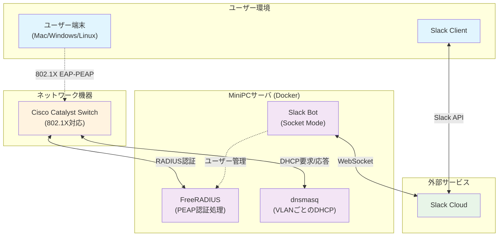

# RADIUS + Slack連携 有線LAN認証システム

本プロジェクトは、社内有線LANのセキュアアクセスを実現するために、**FreeRADIUS + Slack Bot (Socket Mode) + dnsmasq + Cisco Catalyst スイッチ** を組み合わせた仕組みを提供します。  
ユーザーは Slack DM 経由で自分のアカウントを登録・管理し、802.1X認証を通じて LAN 接続を行います。

---

## 🎯 目的と要件

- 端末規模: 30台前後（Mac中心、一部 Windows/Linux）
- セキュリティ要件: 認証済端末のみLAN/インターネット接続可能
- 運用性: 証明書配布は避け、Slack Socket Modeを入口としたユーザーセルフサービスを実現
- ネットワーク機器: Cisco Catalyst (802.1X対応)
- サーバ: MiniPC上でDocker稼働

---

## 🏗 システム全体像




---

## 🔐 認証方式

- **方式**: IEEE 802.1X + EAP-PEAP + MSCHAPv2
- **特徴**:
  - ID/Password をTLSトンネル内でやり取り（平文漏洩防止）
  - サーバ証明書でFreeRADIUSを検証
  - クライアント証明書は不要（運用コスト低減）

---

## 💬 Slack Bot 機能 (Socket Mode)

**Socket Mode接続**でngrok/HTTPS不要。ユーザーは **Slack DMのみ** で操作可能。他人のアカウントは操作不可。

### コマンド一覧

| コマンド              | 機能説明                                                           |
|-----------------------|--------------------------------------------------------------------|
| `/radius_register`     | 自分用のRADIUSアカウント作成、ランダムパスワード生成しDM通知       |
| `/radius_unregister`   | 自分のアカウントを削除                                            |
| `/radius_status`       | アカウントの状態・最終利用日・有効期限などを表示                  |
| `/radius_resetpass`    | パスワードをリセット                                                |
| `/radius_help`         | コマンド一覧と利用方法を表示                                      |

---

## 📦 コンポーネント詳細

### FreeRADIUS
- Dockerイメージ: `freeradius/freeradius-server`
- 設定: `mods-enabled/eap`, `sites-enabled/default`
- ユーザーデータ: Slack Botが `users` ファイルまたは外部DBに書き込み
- 認証失敗端末は VLAN に未所属 → DHCP応答なし

### dnsmasq
- DHCPサーバ（軽量・Docker親和性◎）
- VLANごとのIPレンジ設定
- 設定例:
  ```conf
  interface=eth0.10
  dhcp-range=10.10.10.100,10.10.10.200,12h

  interface=eth0.20
  dhcp-range=10.20.20.100,10.20.20.200,6h
  ```

### Slack Bot (Socket Mode)
- 言語: Python
- ライブラリ: slack_bolt (Socket Mode対応)
- 接続方式: WebSocket (ngrok/HTTPS不要)
- 処理:
  - Socket Mode経由でSlackイベントを受信
  - FreeRADIUSのアカウント作成/削除
  - パスワード生成（安全な乱数 + 一時保存）
  - DMで結果を返す

---

## 📡 ネットワークフロー

1. 端末がスイッチに接続
2. 802.1X認証要求 (EAPOL)
3. ユーザーが Slack Bot で発行されたID/PASSを入力
4. FreeRADIUSで認証
5. 認証成功 → VLAN10へ割当 → DHCPでIP取得
6. 認証失敗 → VLAN未所属 → ネットワーク不可

---

## 🔧 セットアップ手順（概要）

### 1. 環境設定
```bash
cp .env.sample .env
# .envファイルにSlackトークンを設定
cp radius/authorize.sample radius/authorize
# 初期ユーザー定義ファイルを配置（Docker起動後はBotが追記/更新します）
```

### 2. Slack App設定 (Socket Mode)
- Socket Mode を有効化
- App-Level Token を生成 (SLACK_APP_TOKEN)
- Slash Commands に /radius_* を登録
- Bot Token Scopes:
  - chat:write
  - commands
  - im:history
  - users:read

### 3. Docker起動
```bash
docker-compose up -d --build
```

メンテナンス

```bash
docker-compose down && docker-compose up -d --build --force-recreate
docker-compose up -d --build --force-recreate
```

### 4. Cisco Catalyst設定
```cisco
aaa new-model
aaa authentication dot1x default group radius
radius-server host 192.168.1.10 key radiusSecret

interface Gi1/0/1
  switchport mode access
  authentication port-control auto
  dot1x pae authenticator
  authentication event success vlan 10
```

---

## 📁 ディレクトリ構成例

```
project-root/
├── bot/
│   ├── app.py             # Slack Bot エントリ
│   ├── Dockerfile         # Bot コンテナ定義
│   └── requirements.txt   # Python依存パッケージ
├── radius/
│   ├── authorize.sample   # FreeRADIUS ユーザー定義（サンプル）
│   └── certs/             # TLS証明書（開発用）
│       ├── ca.pem         # CA証明書
│       ├── ca.key         # CA秘密鍵
│       ├── server.pem     # サーバ証明書
│       ├── server.key     # サーバ秘密鍵
│       ├── dh             # DH パラメータ
│       └── generate-certs.sh # 証明書生成スクリプト
├── dnsmasq/
│   └── dnsmasq.conf       # DHCP設定
├── docker-compose.yaml    # コンテナ構成定義
└── README.md
```

---

## 🔒 セキュリティ考慮

- パスワードはSlack DMのみ通知、サーバに平文保存しない
- Socket Mode接続で外部ポート公開不要（セキュリティ向上）
- WebSocket通信はSlackが署名検証済み
- アカウント失効（/radius_unregister）やパスワード更新をSlackから即時反映
- ログ管理: 発行ユーザー・時刻・利用状況をDockerログに保存

---

## 🔄 将来拡張

- EAP-TLS証明書方式（証明書配布をSlack Bot経由で行う）
- アカウント有効期限制（一定期間で自動削除）
- 管理者コマンド（全ユーザー一覧、強制削除）
- QRコード / .mobileconfig配布（スマホ対応）
- Webhook方式への移行（高負荷時のスケールアップ対応）

---

## 📜 ライセンス

MIT
